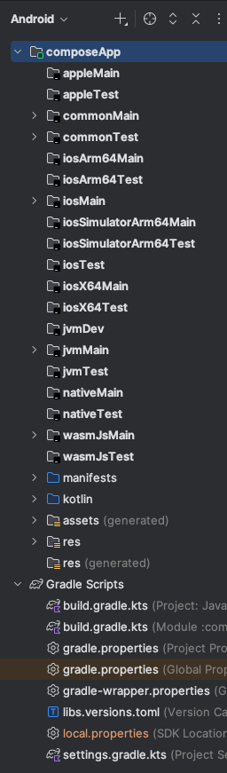
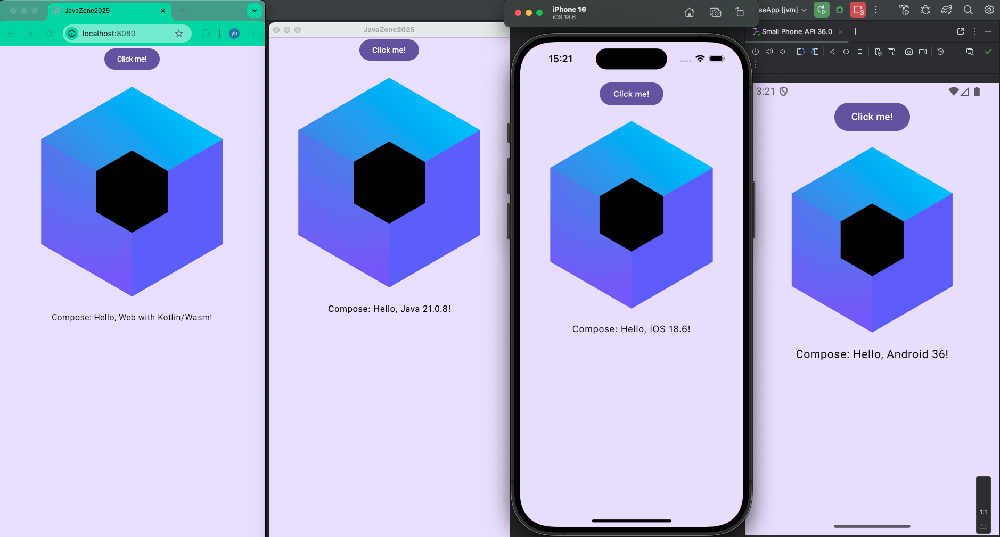
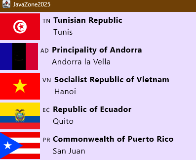

# Compose Multiplatform

Compose Multiplatform is the cross-platform equivalent of Compose for Android (which is the current official UI kit for
Android).
It runs on iOS, Android, the web and desktop (through the JVM).
Thus, it really allows Kotlin to be a _write once, run everywhere_ language.

The current best way to get started in with the [Kotlin playground](https://play.kotlinlang.org/) which renders UI
components in the browser thanks to the support of the web platform.

## First compose App

Let's start by running our first Compose Multiplatform application in the Kotlin playground:

1. Please open [this link to load a sample app](https://pl.kotl.in/20EA85ZqX).
1. Click on the "Run" button to execute the code.
1. You should see a simple UI with a button. Click on the button once and then click it another time.
1. Read the code and analyze how the components are structured.

Compose works a declarative way simialr to React:

- You define the UI in a function using a syntax similar to HTML.
  - In reality, it is a composition of Higher Order Functions (parenthesis are omitted as we have seen in the first part).
  - The first letter is capitalized, which is a convention in Compose (also similar to React).
  - The function must have the `Composable` annotation.
- Any element that changes in the UI must as a **state** using this syntax:
  `var myStateVar by remember { mutableStateOf("Hello World!") }`

The general form of a composable function is:

```kotlin
@Composable
fun MyComposable() {
  var myStateVar by remember { mutableStateOf(initialValue) }
  UiElementWithParams(params) {
    UiElementWithNoParams {
      // Nested UI elements
    }
    UiElementWithParams(params) {
      // Nested UI elements
    }
    // ...
  }
}
```

## Analyzing the code

Let's analyze the `App` function:

```kotlin
@Composable // 1
fun App() { // 2
  MaterialTheme { // 3
    var greetingText by remember { mutableStateOf("Hello World!") } // 4
    var showImage by remember { mutableStateOf(false) } // 5
    var counter by remember { mutableStateOf(0) } // 6
    Column(Modifier.fillMaxWidth(), horizontalAlignment = Alignment.CenterHorizontally) { // 7
      Button(onClick = { // 8
        counter++
        greetingText = "Compose: ${Greeting().greet()}"
        showImage = !showImage
      }) { // 9
        Text(greetingText)
      }
      AnimatedVisibility(showImage) { // 10
        Text(counter.toString())  // 11
      }
    }
  }
}
```

1. The `@Composable` annotation indicates that this function is a composable function, which means it can be used to build the UI.
2. The function `App` is defined, which will be the entry point of our UI (called from the `main` function).
3. `MaterialTheme` is a composable function that provides a Material Design theme for the UI. All the UI are embedded in this theme to ensure consistent styling.
4. `greetingText` is a mutable state variable initialized with `"Hello World!"`. This means that whenever this variable changes, the UI will be recomposed to reflect the new value.
5. `showImage` is also a mutable state variable initialized with `false`, which will control the visibility of the image.
6. `counter` is also a mutable state variable initialized with `0`, which will be used to count the number of button clicks.
7. `Column` is a composable function that arranges its children in a vertical column. The `Modifier.fillMaxWidth()` makes the column take the full width of the parent, and `horizontalAlignment = Alignment.CenterHorizontally` centers the children horizontally.
8. `Button` is a composable function that creates a button. The `onClick` lambda is executed when the button is clicked.
9. Inside the button, we display the `greetingText` using a `Text` composable function.
10. `AnimatedVisibility` is a composable function that controls the visibility of its child based on the `showImage` state. If `showImage` is `true`, the child will be visible, otherwise it will be hidden.
11. Inside the `AnimatedVisibility`, we display the `counter` value as a `Text` composable function.

### Exercises

1. Add a text that displays `JavaZone 2025` above the button.
2. Make the counter start at `2025`

### Practical work: List + Changing the button behaviour

Let's add a list and change the button behaviour to add an item to the list instead of changing the greeting text.

1. Add these imports:

  ```kotlin
  import androidx.compose.foundation.lazy.LazyColumn
  import androidx.compose.foundation.lazy.items
  ```

1. Define a list variable after the `counter`: `var messages by remember { mutableStateOf(listOf("Hello", "Compose")) }`
1. Add a `LazyColumn` inside the `Column` after the `AnimatedVisibility`:

  ```kotlin
  LazyColumn {
    items(messages) { message ->
      Text(message)
    }
  }
  ```

1. Run the app to verify that the list is displayed.
1. Change the button `onClick` lambda to add a new item to the list instead of changing the greeting text:

  ```kotlin
  onClick = {
    counter++
    messages += "Item $counter"
    showImage = !showImage
  }
  ```

1. Let's finish by styling the list items by adding a padding to the `Text` inside the `LazyColumn`.
    - Modify the `Text` inside the `LazyColumn` to:

      ```kotlin
      Text(message, modifier = Modifier.padding(8.dp))
      ```

    - Add the necessary imports:

      ```kotlin
      import androidx.compose.foundation.layout.padding
      import androidx.compose.ui.unit.dp
      ```

A solution is [available here](https://pl.kotl.in/gafzm3lxw)

## Local development

Once you are familiar with the basics, you can use the [Kotlin Multiplatform template](https://kmp.jetbrains.com/) which
generates starter projects.
From this page, generate a new project with the following options (Alternatively, you can use this link to download
the [project template directly](https://kmp.jetbrains.com/generateKmtProject?name=JavaZone2025&id=no.javazone.kotlinworkshop&spec=%7B%22template_id%22%3A%22kmt%22%2C%22targets%22%3A%7B%22android%22%3A%7B%22ui%22%3A%5B%22compose%22%5D%7D%2C%22ios%22%3A%7B%22ui%22%3A%5B%22compose%22%5D%7D%2C%22desktop%22%3A%7B%22ui%22%3A%5B%22compose%22%5D%7D%2C%22web%22%3A%7B%22ui%22%3A%5B%22compose%22%5D%7D%7D%2C%22include_tests%22%3Atrue%7D)):

- Project Name: `JavaZone 2025 Kotlin workshop`
- Project ID: `no.javazone.kotlinworkshop`
- Platforms: Android, iOS (with shared UI), desktop, web (with shared UI)

Once the project is downloaded, unzip it and open it in IntelliJ IDEA or Android Studio.
Next, the IDE takes some time to load the project and download the necessary dependencies.

While the project loads, let's analyze its structure:

- **gradle/libs.versions.toml**: is the central place that lists all the version libraries and plugins of the project. It is called a _version catalog_.
  - In this file, we can note the presence of the Kotlin Multiplatform plugin `kotlinMultiplatform = { id = "org.jetbrains.kotlin.multiplatform", version.ref = "kotlin" }` which handles the compilation of the project into the different targets.
- **build.gradle.kts**: loads all the plugins listed in the version catalog.
- **iosApp**: iOS specific code (in swift) and configuration files. This can be left as is.
- **composeApp**: the application module that contains Kotlin code for the Compose UI.
  - **composeApp/src/commonMain** and **composeApp/src/commonTest**: shared code and resources for all platforms, while the other folders in the **composeApp/src** directory contain platform-specific code.
  - **composeApp/build.gradle.kts**: the Gradle build file for the Compose application. It contains common build configuration as well as platform specific ones.
  - The **commonMain** folder, **commonTest** folder where we want to put most of our code, files and dependencies.

When the project is fully loaded in Android Studio, we can note that the project structure is presented differently in two groups: composeApp (which contains the source sets + resources) and the Gradle script (which also contains the version catalog).



Let's run one of the available targets: Android, jvm (desktop), wasmJs (the browser) or iOS (only possible on macOS).
This illustration below show all what we see when we run all the targets together.
From left to right: wasmJs, jvm, iOS and finally Android.



During development, the desktop target is the best one to use, because it is the fastest to run and supports hot reload (when code changes the running app reloads near-instantly).

## PW: present a list fetched from the internet

In this practical work, we will fetch a list of items from a REST API and display it in our Compose UI.
We will use [ktor client](https://ktor.io/docs/client-create-new-application.html) as our multiplatform HTTP client.
We will use [restcountries.com](https://restcountries.com/) free and public REST API.
Particulartly, we'll call [https://restcountries.com/v3.1/all?fields=name,flag,flags,capital](https://restcountries.com/v3.1/all?fields=name,flag,flags,capital), to fetch countries with their names, flags and capitals.

### Part 1: setup ktor client

- Continue with the previous compose mutltiplatform project or create a new one.
- Open the project and reference the ktor library and its dependencies in the version catalog.
  - The `bundle` section allow to group dependencies in a single alias.
  - `` is used to enable JSON serialisation.
  - ``,``

  ```toml
  [versions]
  # other versions
  ktor = "3.2.3"

  [libraries]
  # other libraries
  ktor-client-core = { module = "io.ktor:ktor-client-core", version.ref = "ktor" }
  ktor-client-darwin = { module = "io.ktor:ktor-client-darwin", version.ref = "ktor" }
  ktor-client-cio= {module ="io.ktor:ktor-client-cio", version.ref = "ktor"}
  ktor-client-android = { module = "io.ktor:ktor-client-android", version.ref = "ktor" }
  kotlin-serialization = {module = "io.ktor:ktor-serialization-kotlinx-json", version.ref="ktor"}
  ktor-client-content-negotiation = {module = "io.ktor:ktor-client-content-negotiation", version.ref= "ktor"}

  [bundles]
  ktor = ["ktor-client-core", "ktor-client-content-negotiation"]

  [plugins]
  # other plugins
  kotlinSerialization = { id = "org.jetbrains.kotlin.plugin.serialization", version.ref = "kotlin" }
  ```

- In the root **build.gradle.kts**, load the serialization plugin.

    ```kotlin
    plugins {
      // other plugins
      alias(libs.plugins.kotlinSerialization) apply false
    }
    ```

- In **composeApp/build.gradle.kts**, apply the serialization plugin .

  ```kotlin
  plugins {
    // other plugins
    alias(libs.plugins.kotlinSerialization)
  }
  ```

- And add the dependencies for ktor in the `kotlin -> sourceSets` part:

  ```kotlin
  kotlin {
    // other options
    sourceSets {
      androidMain.dependencies {
        // other dependencies
        implementation(libs.ktor.client.android)
      }
      commonMain.dependencies {
        // other dependencies
        implementation(libs.bundles.ktor)
        implementation(libs.ktor.client.content.negotiation)
        implementation(libs.kotlin.serialization)
      }
      jvmMain.dependencies {
        // other dependencies
        implementation(libs.ktor.client.cio)
      }
      iosMain.dependencies {
        implementation(libs.ktor.client.darwin)
      }
      wasmJsMain.dependencies {
        implementation(libs.ktor.client.js)
      }
    }
  }
  ```

- Let's check if the setup is correct. In `commonMain/kotlin/.../App.kt`, add the following global variable that contains a ktor client configured with a JSON parser.

  ```kotlin
  val httpClient = HttpClient {
    install(ContentNegotiation) {
      json(json = Json { ignoreUnknownKeys = true }, contentType = ContentType.Any)
    }
  }
  ```

- Next, call the get method on the httpClient instance. Since the get method is a suspending function, it needs to be called from a coroutine or another suspending function (this concept is similar to async/await in JavaScript). Compose provides many tools to work with coroutines. One of them is the `LaunchedEffect` composable that runs some code, within a coroutine, when the parent composable is first launched.

  ```kotlin
  fun App() {
    LaunchedEffect(Unit) {
      val response = httpClient.get("https://restcountries.com/v3.1/all?fields=name,flag,flags,capital")
      val body = response.body<String>()
      println(body)
    }
    // remainder of the code
  }
  ```

- Run the app on desktop with `./gradlew run`. You should see in the terminal the JSON response from the REST API.

  ```txt
  [{"flags":{"png":"https://flagcdn.com/w320/tn.png",...
  ```

- Just to be sure, you can run the app in other targets:
  - Web: `./gradlew wasmJsBrowserDevelopmentRun` or via the run button in the IDE
  - Android via the run button in the IDE
  - iOS via the run button in the IDE

Congrats, we now have a cross-platform HTTP client that we can use.

### Part 2 - JSON serialization

In the previous part, we didn't parse the response body and just processed it as a String.
Let's parse the JSON response into data classes.
Try to guess the data classes we need before looking at a solution below.

```kotlin
@Serializable
data class CountryFlagCatalog(val png: String, val svg: String, val alt: String)

@Serializable
data class CountryName(val common: String, val official: String)

@Serializable
data class Country(
  val name: CountryName,
  val flag: String,
  val flags: CountryFlagCatalog,
  val capital: List<String>
)
```

The serializable annotation is important because it allows ktor to introspect the data classes and automatically serialize/deserialize them to/from JSON.

Next, we need to tell ktor that it needs to parse the body as a list of countries (in Kotlin, it is this type `List<Country>`).
There are many ways to do it depending on where we provide this information; at variable declaration, at the call site, or as a return value of a function.
Let's see some possible solutions:

- At the call site; just replace this line `val body = response.body<String>()` with the following one.

  ```kotlin
  val body = response.body<List<Country>>()
  ```

- At variable declaration: in this case, Kotlin can infer the type from the assignment. Replace this line `val body = response.body<String>()` with this line:

  ```kotlin
  val response: List<Country> = httpClient.get("https://restcountries.com/v3.1/all?fields=name,flag,flags,capital")
  ```

- As a return value of a function; is simialr to the previous solution but the type is inferred from the return value instead of being explicitly declared. Replace this code:

  ```kotlin
  LaunchedEffect(Unit) {
    val response = httpClient.get("https://restcountries.com/v3.1/all?fields=name,flag,flags,capital")
    val body = response.body<String>()
    println(body)
  }
  ```

  with this one:

  ```kotlin
  suspend fun fetchCountries(): List<Country> {
    val response = httpClient.get("https://restcountries.com/v3.1/all?fields=name,flag,flags,capital")
    return response.body() // This will be parsed to List<Country> and is inferred from the return type
  }

  LaunchedEffect(Unit) {
    val countries = fetchCountries()
    println(countries)
  }
  ```

- Run the app again to check that it still prints the list of countries.

### Part 3 - exercise

Using the previous exercises as a reference, display the list of countries in a `LazyList`.
Also, display the flags using both the emoji and the svg.
For the latter, the [coil](https://coil-kt.github.io/coil/) library provides access to the `AsyncImage` composable, which loads an image from a url.

⚠️ the emojis may not show correctly on winodws.



### Solutions

The solutions of the different steps are available the [02-frontend](./02-frontend/) folder.

## Going further

We just scratched the surface of what is possible with Compose Multiplatform.
Here are some tracks to go further.

- The list of [material3 components](https://kotlinlang.org/api/compose-multiplatform/material3/) supported by Compose multiplatform.
- Jetpack Compose provides [architecture guidelines](https://developer.android.com/topic/architecture/recommendations) an official code architure to make the code more maintainable.
- JetPack compose documentation can also serve as a documentation for compose multiplatform [as explained in this page](https://www.jetbrains.com/help/kotlin-multiplatform-dev/compose-multiplatform-and-jetpack-compose.html). This means, that we can follow the [official Jetpack compose tutorial](https://developer.android.com/develop/ui/compose/tutorial) which also applies mostly to compose multiplatform.

## Links and references

- [Kotlin Compose Multiplatform: Integrating Ktor with Search for Android, iOS and Desktop](https://blog.stackademic.com/kotlin-compose-multiplatform-integrating-ktor-with-search-for-android-ios-and-desktop-d31b9d1bd0e2)
