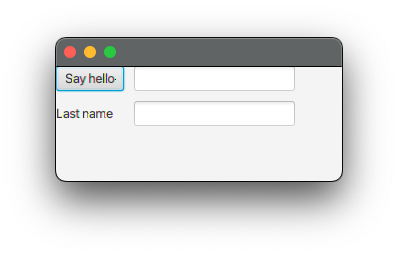

# JavaFX

JavaFX (or openJFX) is considered to be the default cross-platform GUI toolkit for Java.
Since Kotlin is interoperable with Java, it can be used to build JavaFX applications as well.
We can even benefit from Kotlin DSLs to build JavaFX applications in a more idiomatic way.

## Getting started

1. Open the [ktfx-starter](./ktfx-starter) folder in a new IntelliJ IDEA window.
1. Consult the content of the file [App.kt](./ktfx-starter/app/src/main/kotlin/org/example/App.kt). Notice how the JavaFX application is structured with a DSL.
1. Run the app by launching gradle `run` (by running the command line `./gradlew run` or from the gradle tool window).

