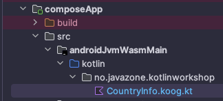

# Exercise: country info with AI

Add a feature to the app developed in Compose in Step 2 which relies on LLMs.
For example, you could use an LLM to provide information about a country when the user selects it in the list.
The information will be shown in a `Text` above the `LazyColumn`.

You can continue with the app that you worked on, or start from a solution available here: [02-frontend/compose-03-country-list-final-step](./02-frontend/compose-03-country-list-final-step/)

⚠️ We'll be hardcoding the api key in a front-end which a red alert security practice.
Please be careful not to push it to a public repository and to not include api keys in public fronts, whether they are, mobile, desktop or web.
It is possible to do it for servers and for non-public applications.
What we are going to do is just for the sake of example.

- In the version catalog, add the dependency to the Koog library:

  ```toml
  koog = "0.4.0"

  [libraries] 
  koog-agents = { module = "ai.koog:koog-agents", version.ref = "koog" }
  ```
  
- In the `commonMain` sourceSet, define the `CountryInfo.kt` file that defines the composable that will show the AI response.
  
  ```kotlin
  @Composable
  fun CountryInfo(countryName: String) {
    var countryInfo by remember { mutableStateOf("") }
    LaunchedEffect(countryName) {
      countryInfo = ""
      if (countryName.isNotBlank()) {
        countryInfo = getCountryInfo(countryName)
      }
    }
    Text("Country $countryName info from AI : $countryInfo")
  }
  
  @Preview
  @Composable
  fun PreviewCoutryInfo() {
    CountryInfo("France")
  }
  ```

- The `CountryInfo` composable uses a `getCountryInfo` function to get the information about the country. Since the latter uses Koog which is not available on iOS yet, we must provide two implementations, one for iOS, and one for the other platforms. This is possible thanks to the expect/actual mechanism of Kotlin Multiplatform.
- In the same `countryInfo.kt` file, add the expect declaration for the `getCountryInfo` function:

  ```kotlin
  expect suspend fun getCountryInfo(countryName: String): String
  ```

- Let's start by providing the iOS implementation. In the `iosMain` source set, create a new file `CountryInfo.ios.kt` and add the following code:

  ```kotlin
  actual suspend fun getCountryInfo(countryName: String): String {
    return "iOS is not supported yet"
  }
  ```

- For the other platforms, we need to create a `androidJvmWasmMain` source set to share code between android, jvm and wasmJS targets. 
  This source set also depends on the koog library.
  In the application module's **build.gradle.kts**, add the following code which defines a common source set for android, jvm and wasmJS:

  ```kotlin
  sourceSets {
    // other source sets
    val androidJvmWasmMain by creating {
      dependsOn(commonMain.get())
      androidMain.get().dependsOn(this)
      wasmJsMain.get().dependsOn(this)
      jvmMain.get().dependsOn(this)
      dependencies {
        implementation(libs.koog.agents)
      }
    }
  }
  ```
  
- Since we are adding a custom source sets, gradle may probably complain abount the iOS source set not being configured correctly.
  To fix that, add the following code to the `sourceSets` block in the **build.gradle.kts** file:

  ```kotlin
  sourceSets {
    // other source sets
    iosMain {
      dependsOn(commonMain.get())
      iosX64Main.get().dependsOn(this)
      iosArm64Main.get().dependsOn(this)
      iosSimulatorArm64Main.get().dependsOn(this)
    }
  }
  ```

- In your project folders, create the new source set folder `composeApp/src/androidJvmWasmMain/kotlin`. Inside that folder, create a new package `no.javazone.kotlinworkshop` and add a new file `CountryInfo.koog.kt` (the *.koog* is not important, it's just to avoid name conflicts).
- Sync Gradle to make sure the new source set is recognized.
  
- Inside the `CountryInfo.koog.kt` file, add the following code:

  ```kotlin
  actual suspend fun getCountryInfo(countryName: String): String {
    val agent = AIAgent(
        executor = simpleGoogleAIExecutor(AI_API_KEY),
        systemPrompt = systemPrompt,
        llmModel = GoogleModels.Gemini2_0FlashLite
    )
    return agent.run(countryName)
  }
  ```
- ⚠️ Please be careful about the `AI_API_KEY` variable. You should not hardcode-it your API key in the source code. This is just for the sake of the example, for non-public applications, or for servers.
- Next, change the `CountryList` composable so that it shows a button next to each row. When the button is clicked, the `CountryInfo` composable is shown with the information about the selected country.

  ```kotlin
  @Composable
  fun CountryList() {
    var countries by remember { mutableStateOf(listOf<Country>()) }
    var selectedCountryName by remember { mutableStateOf("") }
    LaunchedEffect(Unit) {
      countries = fetchData()
    }
    Column {
      CountryInfo(selectedCountryName)
      LazyColumn {
        items(countries) { country ->
          Row {
            Button(onClick = { selectedCountryName = country.name.official }) {
              Text("Select")
            }
            CountryItem(country)
          }
        }
      }
    }
  }
  ```

- Run the app on the different platform to see the result.

A solution is available here: [03-ai/AI-01-final-step](./03-ai/AI-01-final-step)
