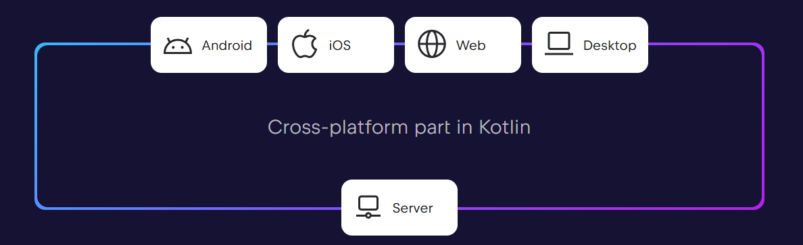

# JavaZone 2025 Kotlin Workshop

Welcome to the Kotlin workshop for JavaZone 2025!

[wrl.li/jz25-kt](https://wrl.li/jz25-kt)

The goal of this workshop is to illustrate how Kotlin is a **write once, run everywhere** language.
Indeed, Kotlin can target Android, iOS, Web, Desktop, and Server.

Two agendas are proposed: a 2-hour one for the workshop and 3-day one that includes all the content and can be used as a Kotlin training.
The agenda provides a general guideline, you are free to follow other parts if you want to explore other aspects of Kotlin.

For both agenda, we'll be using different frameworks and libraries.
The aim is not teach all concepts in great detail, but rather to give you an overview of what is possible.
So, let's get started!

## Preparation

1. Clone this repository `git clone https://github.com/worldline/kotlin-workshop-javazone2025.git`
1. If you want to use Android Studio, install these plugins
  - Kotlin Multiplatform for macOS users and [Compose Multiplatform for Desktop IDE Support](https://plugins.jetbrains.com/plugin/16541-compose-multiplatform-for-desktop-ide-support) for Windows and Linux.
    - Kotlin notebooks
1. If you want to use IntelliJ IDEA, install the Android plugin as well
1. Optional plugins for both
  IDEs: [Indent Rainbow](https://plugins.jetbrains.com/plugin/13308-indent-rainbow), [Rainbow Brackets Lite - Free and OpenSource](https://plugins.jetbrains.com/plugin/20710-rainbow-brackets-lite--free-and-opensource)
1. For macOS users: XCode
1. [Gradle](https://gradle.org/install/) (on Windows, you can use [Scoop](https://scoop.sh/) or [Chocolatey](https://chocolatey.org/install))

## 2h agenda for the workshop

1. (30 minutes) Important Kotlin language features for the workshop: [01-01-kotlin-tour.ipynb](./01-01-kotlin-tour.ipynb)
2. (50 minutes) Compose Multiplatform: [02-01-compose.md](02-01-compose.md)
3. (10 minutes) Koog: [03-01-koog.ipynb](./03-01-koog.ipynb)
4. (30 minutes) Exercise: Koog + Compose Multiplatform application: [03-02-koog-compose-exercise.md](./03-02-koog-compose-exercise.md)

Extra time (if any):

1. Ktor: [04-02-backend-kt.md](./04-02-backend-kt.md)
2. Data Science with Kotlin: [05-01-datascience.ipynb](./05-01-datascience.ipynb) and exercises: [05-02-datascience-exercises.ipynb](./05-02-datascience-exercises.ipynb)

## Complete agenda (for a 3-day training)

We will see different application types: frontend, backend, AI-powered, and data science.
That's why there are 5 parts, where part 1 is a quick tour of the Kotlin language and the other parts cover different application types.
It is recommended to follow part 1 first. You can follow the other ones in any order, but you can stick to the agenda if you want to experience the aspects where multiplatform shines the most.

### Part 1 - Tour of the Kotlin language

- It is also possible to follow this part by opening notebooks in GitHub and doing the exercises in the Kotlin Playground.

This section is a quick tour of the Kotlin language to get you familiar with its syntax and main features.
It is also a preparation to better tackle the next sections.
When needed, you can go back to this section to check how some language features work.

1. Open this notebook to try some prominent Kotlin features: [01-01-kotlin-tour.ipynb](./01-01-kotlin-tour.ipynb)
2. Next, let's do some exercises that are listed in the file [01-02-exercises.ipynb](./01-02-exercises.ipynb)
3. The solutions are available in [01-02s-solutions.ipynb](./01-02s-solutions.ipynb)
4. Finally, let's quickly see how OOP is done in Kotlin: [01-03-oop.ipynb](./01-03-oop.ipynb)
5. (Optional) For more features, please open this file: [01-04-more-language-features.ipynb](./01-04-more-language-features.ipynb)

### Part 2 - Frontend development

Kotlin supports existing JS and JVM UI frameworks thanks to its multiplatform capabilities,
meaning that we can code ReactJS or JavaFX applications using Kotlin.
It also has its own UI framework called Compose Multiplatform, which supports desktop (Windows, macOS, Linux), web, and mobile (Android and iOS), making it a *write once, run anywhere* framework.
Thanks to Kotlin DSL capabilities, UIs can be described in a declarative way, similar to HTML.

In this part, we'll focus on Compose Multiplatform, but there is also a bonus section on JavaFX.

1. Compose Multiplatform: [02-01-compose.md](02-01-compose.md)
1. (Bonus) JavaFX with Kotlin: [02-02-javafx.md](02-02-javafx.md)

## Part 3 - AI-powered applications

After the AI boom, many AI libraries have been created.
Kotlin supports the famous JVM library LangChain4j and has its own AI library called Koog.

We'll focus on Koog in this part since it supports the Web and Desktop targets, making it a nice showcase for **write once, run everywhere**.

1. Koog: [03-01-koog.ipynb](./03-01-koog.ipynb)
2. Exercise: Koog + Compose Multiplatform application: [03-02-koog-compose-exercise.md](./03-02-koog-compose-exercise.md)
3. (Bonus) Langchain4j:

## Part 4 - Backend development

Kotlin supports JVM and JS frameworks.
In addition to that, it also has Kotlin-exclusive ones (that usually run on the JVM or native).

We'll start with JVM frameworks because they are very popular, then Kotlin native ones.
Finally, we leave JS runtimes as a bonus since it is not as straightforward as the others.

1. JVM frameworks: [04-01-backend-jvm.md](./04-01-backend-jvm.md)
1. Ktor: [04-02-backend-kt.md](./04-02-backend-kt.md)
1. (Bonus) JS frameworks: [04-03-backend-js.md](./04-03-backend-js.md)

## Part 5 - Data Science

With its support for Jupyter notebooks and the availability of JVM (such as Spark) and Kotlin native analysis and plotting libraries, Kotlin is a great language for data science.

1. Data Science with Kotlin: [05-01-datascience.ipynb](./05-01-datascience.ipynb)
2. Exercises: [05-02-datascience-exercises.ipynb](./05-02-datascience-exercises.ipynb)
3. Solutions: [05-02s-datascience-exercises-solutions.ipynb](./05-02s-datascience-exercises-solutions.ipynb)
