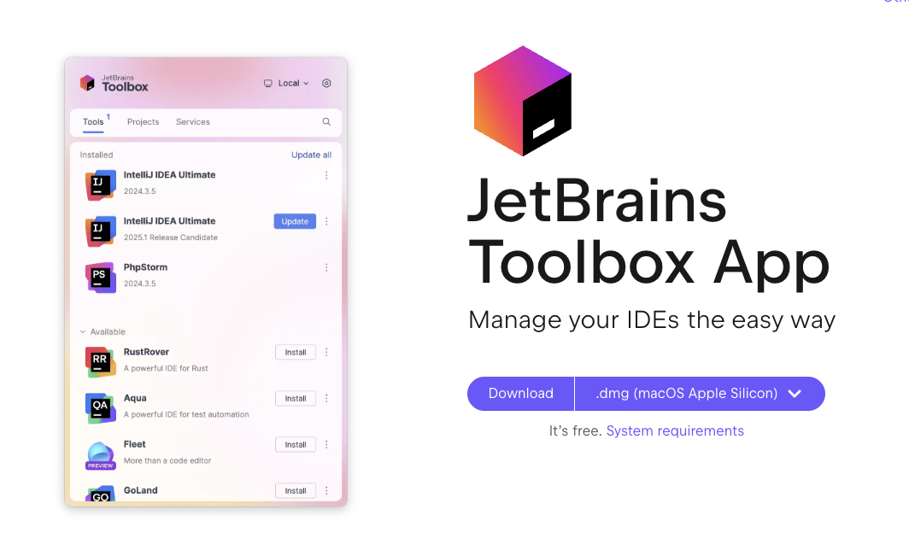

# JavaZone 2025 Kotlin workshop

## Preparation

1. Clone this repository `git clone https://github.com/worldline/kotlin-workshop-javazone2025.git`
1. Download and Install IntelliJ IDEA, preferably through [JetBrains Toolbox](https://www.jetbrains.com/toolbox-app/).
    - Download and install the toolbox for your OS
        
    - Use the toolbox to install IntelliJ IDEA
        

## Part 1 - Tour of the Kotlin language

- _Expected duration: 20 minutes_

1. [Tour of the language](./01-language.ipynb) (duration 20 minutes)
2. [Exercices](./02-exercises.ipynb) (duration 10 minutes)
3. [Object Oriented Programming](03-oop.ipynb) (duration 5 minutes)
4. [Frontend development](./04-frontend.ipynb) (duration 30 minutes)
5. [Backend development](./05-backend.ipynb) (duration 30 minutes)
